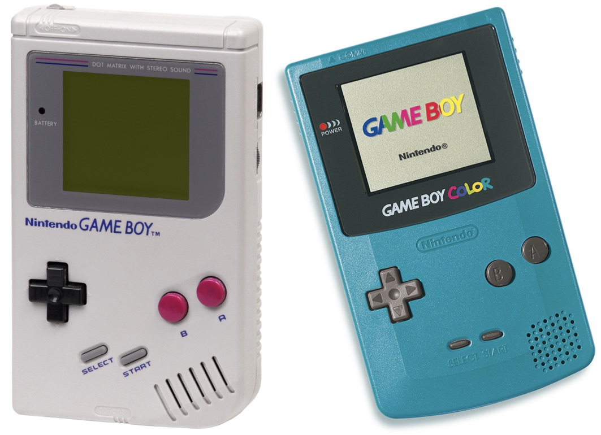
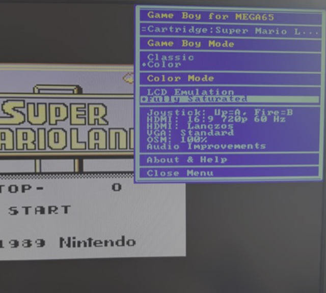
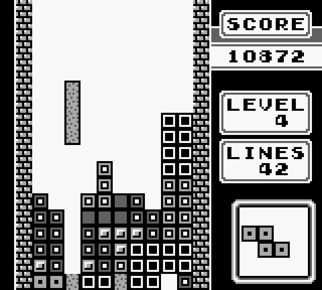
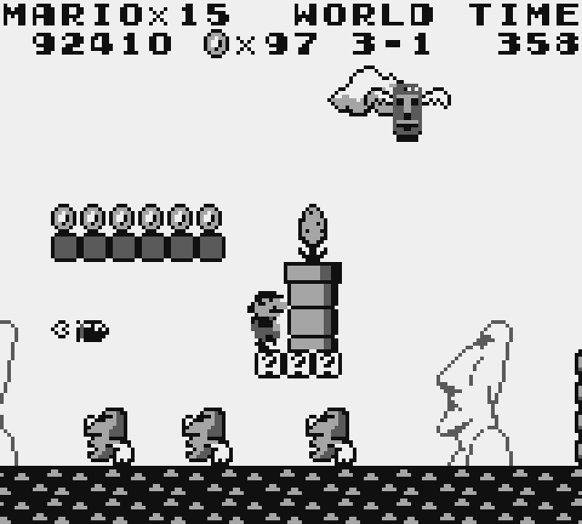
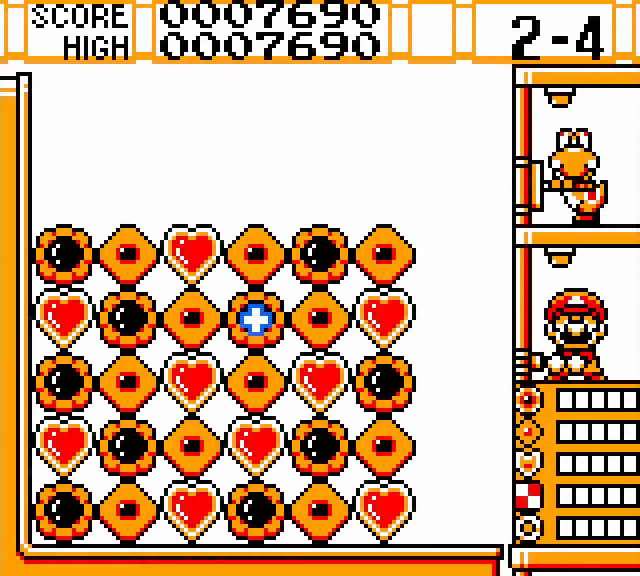
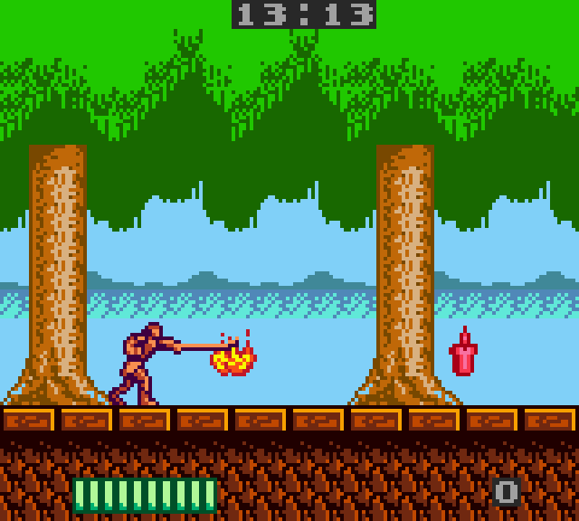
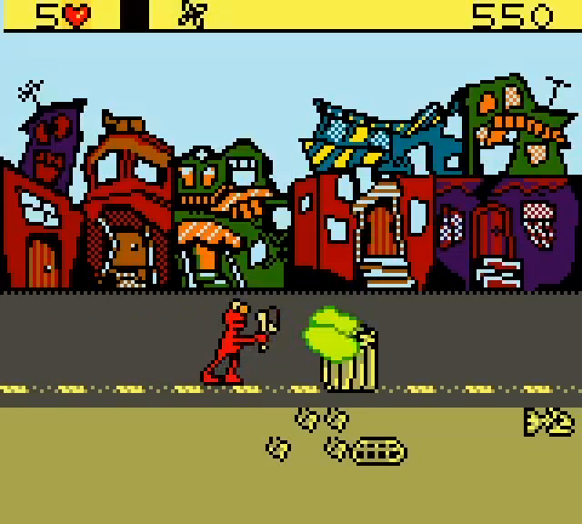

Game Boy and Game Boy Color for MEGA65
======================================

Play [Game Boy](https://en.wikipedia.org/wiki/Game_Boy) and
[Game Boy Color](https://en.wikipedia.org/wiki/Game_Boy_Color) games on your
[MEGA65](https://mega65.org/)! The core is super stable and plays 99% (or
more) of all Game Boy and Game Boy Color games, given that the cartridge ROM
size of the game is up to 1 MB.

Version 1.0 supports all current MEGA65 models (R3/R3A, R4, R5 and R6) and is
built on the [MiSTer2MEGA65](https://github.com/sy2002/MiSTer2MEGA65)
framework - the framework whose creation was originally inspired by this very
core, back in 2021.

Credits
-------

* This core is based on the
  [MiSTer](https://github.com/MiSTer-devel/Gameboy_MiSTer) Game Boy core which
  itself is based on the [MiST](https://github.com/mist-devel/gameboy)
  Game Boy core by Till Harbaum.
* [sy2002](http://www.sy2002.de) and
  [MJoergen](https://github.com/MJoergen) ported the core to the MEGA65
  in 2021 - 2026. Special thanks to
  [Robert Peip](https://github.com/RobertPeip) for his invaluable support.
* The included Open Source Game Boy Color BIOS is from the
  [SameBoy](https://github.com/LIJI32/SameBoy) project.
* Powered by [MiSTer2MEGA65](https://github.com/sy2002/MiSTer2MEGA65) and
  [QNICE-FPGA](https://github.com/sy2002/QNICE-FPGA).

See [AUTHORS](AUTHORS) for the complete list of credits.

Features
--------

* Game Boy and Game Boy Color support (the core starts in Game Boy Color
  mode)
* Convenient on-screen-menu and cartridge file browser which supports long
  filenames; all settings are saved to the SD card (via the settings file
  that is included in the release ZIP, see Installation)
* [Joystick support](doc/joystick.md) in both ports including special
  mappings so that you can for example play Super Mario Land via joystick
* [Color grading](doc/colormodes.md) that reproduces how the colors looked
  on the LCD display of the original Game Boy Color hardware - switchable
  to fully saturated raw RGB colors
* HDMI: four 60 Hz [display modes](doc/video_modes.md), eight image filters
  from razor sharp to CRT simulation, flicker-free HDMI and selectable
  Small, Medium and Full Handheld LCD (10:9) sizes or TV-style (4:3) geometry
* VGA: standard 31 kHz output plus two
  [retro 15 kHz modes](doc/video_modes.md) for CRT monitors and
  RGB/SCART setups
* Audio on HDMI and on the 3.5 mm analog jack, with an optional filter
  stage ("Audio Improvements")
* Support for both MEGA65 SD card slots
* Works out of the box: an Open Source Game Boy Color BIOS
  ([boot ROM](doc/bootroms.md)) is included

Installation
------------

1. Download the ZIP file that contains the core from the
   [MEGA65 FileHost](https://files.mega65.org?id=03b68172-d6ff-49f0-971e-15bea2c6ad9a)
2. [Install the core](https://kugelblitz360.github.io/m65-altcores/how-to-use-alternative-cores.html)
3. The core needs a FAT32 formatted SD card to load game cartridges (ROMs).
4. If you put your ROMs into a folder called `/gbc`, then the file browser
   will display this folder on startup. The core supports `.gb` (Game Boy)
   and `.gbc` (Game Boy Color) files up to 1 MB. In Game Boy Classic mode,
   the browser deliberately shows only `.gb` files.
5. Copy the settings file from the ZIP (for example
   `gbc4mega65-V1.0.cfg`) into the `/gbc` folder of your SD card: it
   enables the core to remember all your on-screen-menu settings.
6. The core includes an Open Source Game Boy Color BIOS. For more
   authenticity, learn [here](doc/bootroms.md) how to use an original BIOS.

Getting started
---------------

After you start the core, a welcome screen explains the keyboard mapping;
the picture stays dark until you load the first game cartridge. Here are
the most important hints:

* Press <kbd>Help</kbd> to open and to close the on-screen-menu. Load a
  cartridge via the menu item `Cartridge`: Choose a Game Boy ROM (normally
  having the file extension `.gb`) or a Game Boy Color ROM (`.gbc`) from any
  folder of your SD card using the cursor keys and <kbd>Return</kbd> to
  navigate. The game starts as soon as it is loaded.

* Use <kbd>Space</kbd> as the Game Boy's "Start" key and <kbd>Return</kbd>
  as the Game Boy's "Select" key. <kbd>Left Shift</kbd> is Game Boy's "A"
  and <kbd>Mega 65</kbd> is Game Boy's "B". The cursor keys of the MEGA65
  are the Game Boy's joypad. The menu item `About & Help` shows this
  keyboard mapping at any time.

* In the on-screen-menu you can switch between Game Boy Color and Game Boy
  Classic, configure the [joystick mapping](doc/joystick.md), choose between
  two [color modes](doc/colormodes.md) and configure the
  [video output](doc/video_modes.md). The core remembers all your settings
  as soon as the settings file from the release ZIP is in the `/gbc` folder
  (Installation, step 5).

Some demo pictures
------------------

|  |  |  |
|:------------------------------------------------------:|:------------------------------------------------:|:--------------------------------------------------------------------:|
| *Game Boy for MEGA65 menu*                             | *Tetris*                                         | *Super Mario Land*                                                   |
|  |  |  |
| *Yoshi's Cookie in Color mode*                                                   | *Castlevania: The Adventure*                                                                      | *Elmo in Grouchland*                                                             |

Clarification: These screenshots are just for illustration purposes.
This repository does not contain any copyrighted ROMs
such as BIOS ROMs or game ROMs.

Game Boy Mode and cartridges
----------------------------

The core starts in **Game Boy Color** mode: Game Boy Color games and Color
enhanced Game Boy games are rendered in color, and even pure Game Boy
Classic games are colorized by the Game Boy Color BIOS - exactly as on the
real hardware. Switch to **Game Boy Classic** in the on-screen-menu to play
games in the authentic grayscale look. Changing this mode automatically
resets the Game Boy machine so the selected boot ROM and mode take effect
immediately; the loaded cartridge remains available and starts again. A
Color-only cartridge cannot be loaded in Classic mode, and while one is
running the menu prevents switching from Color to Classic. Ordinary Game
Boy and dual-compatible Color-enhanced cartridges may switch either way.

The core checks each cartridge before loading it: the maximum supported
cartridge (ROM) size is 1 MB and the cartridge needs to use one of the
supported Memory Bank Controllers (ROM only, MBC1, MBC2, MBC3 and MBC5,
which covers the vast majority of all games ever released). Compatibility
is taken from the cartridge header, so merely renaming a Color-only ROM to
`.gb` cannot bypass the Classic-mode safeguard.

There are no savegames yet: highscores and game states are lost when the
core is switched off (exactly as in V0.8).

Boot ROMs (BIOS)
----------------

The core works out of the box: Game Boy Color mode uses the included Open
Source boot ROM (BIOS) from the
[SameBoy](https://github.com/LIJI32/SameBoy) project and Game Boy Classic
mode uses the boot ROM that is built into the MiSTer Game Boy core. For
more authenticity you can put the original Game Boy Color BIOS into the
`/gbc` folder of your SD card; the core loads it automatically at startup.
The Classic boot ROM is part of the core itself and cannot be replaced.
Learn more in the [boot ROM documentation](doc/bootroms.md).

Joystick usage and mapping
--------------------------

Basic usage: Just plug your joystick into port #1 or #2 of the MEGA65. Both
ports work in parallel - even while the on-screen-menu is open, so the game
stays playable while you adjust settings. By default the fire button of the
joystick is mapped to the Game Boy's A button, which is fine for many
games - and for games that jump with A or B (such as Super Mario Land or
Castlevania) the on-screen-menu offers three more
[mapping modes](doc/joystick.md).

Color Modes
-----------

For Game Boy Color games you can choose between two
[color modes](doc/colormodes.md) in the on-screen-menu: "LCD Emulation"
(the default) performs a color grading that approximates the historical
color LCD screen and "Fully Saturated" shows the raw, unprocessed colors.

Video output
------------

HDMI and VGA are active simultaneously. The HDMI output offers four 60 Hz
display modes, eight image filters, a flicker-free mode, three Handheld LCD
(10:9) picture sizes and a TV-style (4:3) choice;
the VGA output offers a standard 31 kHz mode and two retro 15 kHz modes for
CRT monitors, including composite sync (CSYNC) for RGB/SCART setups. Learn
more in the [display documentation](doc/video_modes.md).

Important: If you use a VGA display or an analog retro monitor, switch off
"HDMI: Flicker-free" in the on-screen-menu. Flicker-free makes the sync
frequency of the analog output step slightly, which analog displays
dislike.

Audio
-----

Audio is available on HDMI and on the 3.5 mm analog jack simultaneously. By
default you hear the raw output of the Game Boy's sound unit. Switch on
"Audio Improvements" in the on-screen-menu to route the sound through a
gentle low-pass filter chain (the MiSTer standard audio filter) that
softens the raw square waves, comparable to the analog output stage of the
original hardware.

SD cards
--------

SD cards need to be formatted with FAT32. If you have a folder called
`/gbc`, then the file browser will start in this folder, and the core will
also look for [boot ROMs](doc/bootroms.md) and store its settings file
there.

Both SD card slots of the MEGA65 are supported. The back slot ("external")
has precedence over the bottom tray slot ("internal"): If you insert a card
into the back slot, then it is used, otherwise the card in the bottom tray
slot. While the file browser is open, you can use <kbd>F1</kbd> to manually
switch to the internal card and <kbd>F3</kbd> to switch to the external
card.

For developers
--------------

gbc4mega65 is Open Source (GPL v3). Learn how to
[build the core from source](doc/developers.md) or read how the
[documentation website](doc/make_doc.md) is generated.
