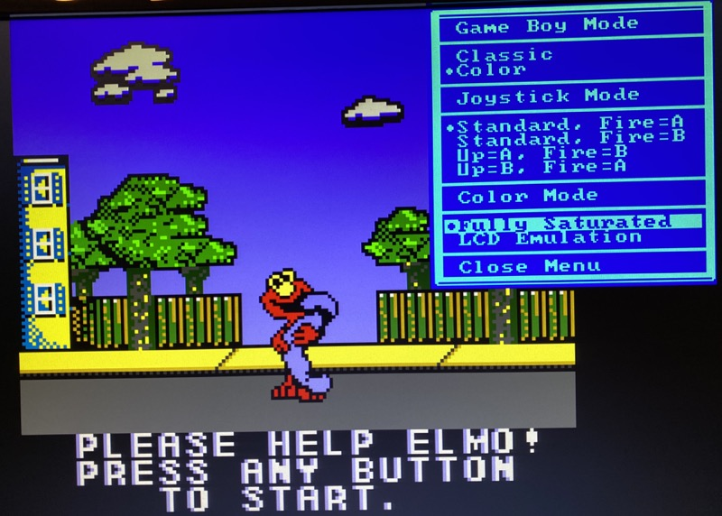
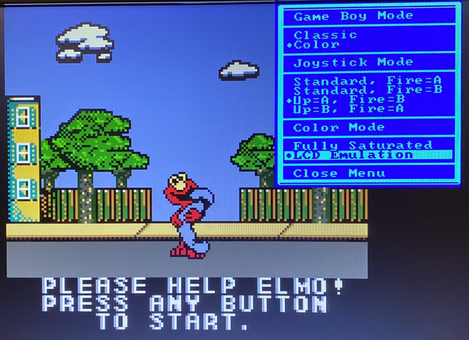

# Color modes

The LCD screen of the original Game Boy Color hardware displayed rather
washed out colors. Game developers back then knew this and chose their color
palettes accordingly: A game that looks garish on a modern display may have
looked exactly right on the real hardware.

This is why the on-screen-menu offers a "Color Mode" section with two modes:

* **Fully Saturated**: The raw RGB values of the Game Boy Color are shown
  without any processing.

* **LCD Emulation** (default): A color grading is applied that approximates
  how the colors looked on the historical LCD screen. It is based on the
  well-known color-correction used by MiSTer. Because most games were
  designed with that screen in mind, this is the default.

## Comparison

The following screenshots from "Adventures of Elmo in Grouchland" show the
difference: The yellow house turns orange/brown and Elmo turns from a clear
red into a ruby tone.

*Fully Saturated: raw RGB colors*

*LCD Emulation: color grading approximating the historical LCD*

## Game Boy Classic

The color modes only affect Game Boy Color games: In Game Boy Classic mode,
the core always renders the authentic 4-shade grayscale.

## Learn more

If you want to dive deeper into the topic of color emulation, read this
[article about color emulation](https://web.archive.org/web/20210223205311/https://byuu.net/video/color-emulation/).
