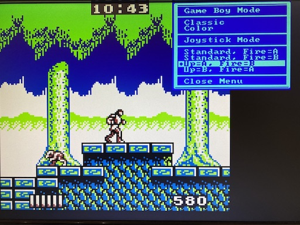

# Joystick usage and mapping

Playing with a joystick is as simple as it gets: Plug your joystick into
port #1 or port #2 of the MEGA65. Both ports work in parallel, so you do not
need to remember which one is the "right" one. The joysticks even stay
active while the on-screen-menu is open: the game keeps running and remains
playable while you adjust settings.

The joystick's directions are mapped to the Game Boy's d-pad and the fire
button is mapped to the Game Boy's A button by default. This default mode is
called "Standard, Fire=A" and it works fine for many games.

## Choosing a mapping mode

The Game Boy has two action buttons, A and B, and different games use them
differently. This is why the on-screen-menu (press <kbd>Help</kbd> to open
it) offers a "Joystick: <current mapping>" submenu with four modes:

| Joystick Mode      | Fire button | Joystick up               |
|--------------------|-------------|---------------------------|
| Standard, Fire=A   | A           | d-pad up                  |
| Standard, Fire=B   | B           | d-pad up                  |
| Up=A, Fire=B       | B           | A **and** d-pad up        |
| Up=B, Fire=A       | A           | B **and** d-pad up        |

The two "Up" modes deserve an explanation: Games like Super Mario Land and
Castlevania use the A button to jump. With the mode "Up=A, Fire=B" you jump
by moving the joystick up - exactly how jumping feels natural on a classic
home computer - while the fire button is used for the action mapped to B
(such as attacking with the whip in Castlevania).

Moving the joystick up in the two "Up" modes not only presses the A (or B)
button but *also* presses d-pad up at the same time. This is important in
games like Castlevania: You can still climb stairs by pushing up, and you
jump naturally, too.

The screenshot shows the classic V0.8 options menu; its options live on in
the V1.0 on-screen-menu.

Like all settings of the core, the joystick mode is saved to the SD card, so
the core remembers your choice.
